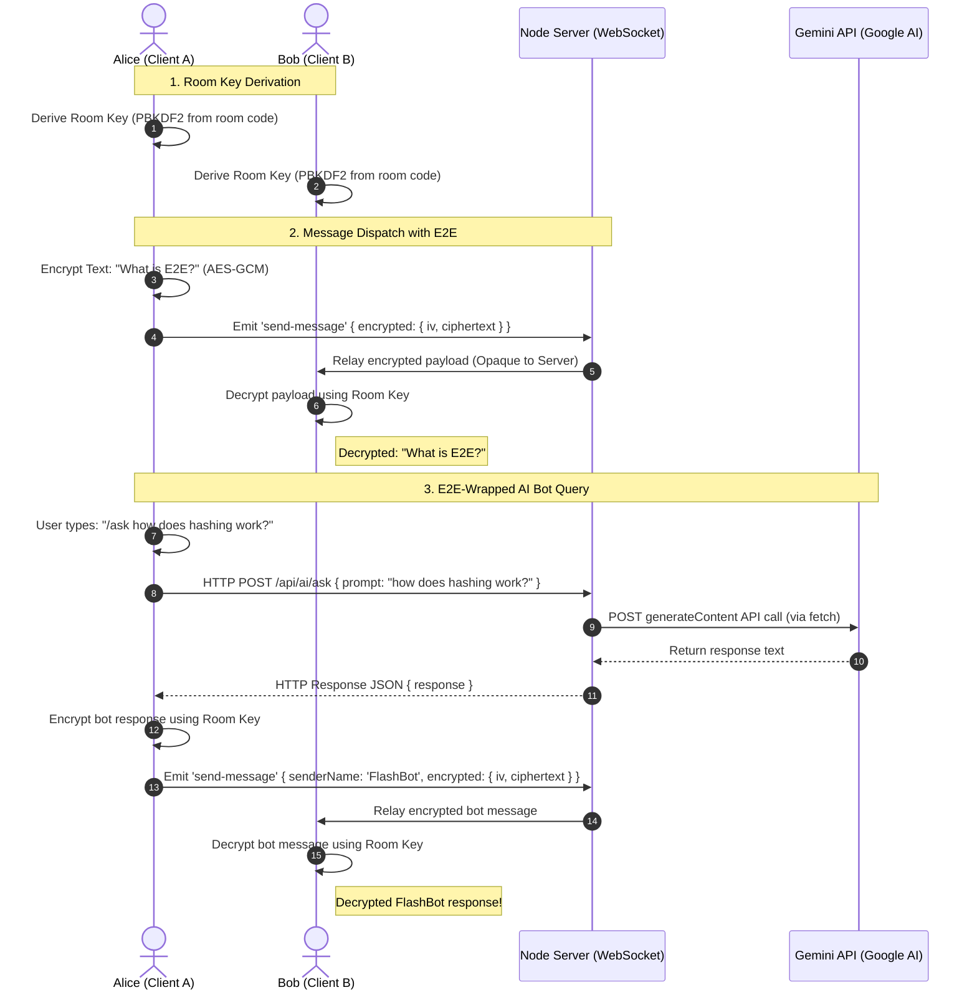

# ⚡ FlashChat v2.0 — Ephemeral & E2E Encrypted Chat Portal

> **GitHub Finish-Up-A-Thon Challenge Submission**
> Live Demo (Frontend): *[Default Vercel deployment]*
> Live Demo (Backend API): *[Default Hostinger VPS reverse proxy]*

FlashChat is a privacy-first, zero-login, temporary messaging and file-sharing portal. Reimagined and rebuilt for the GitHub Finish-Up-A-Thon, FlashChat v2.0 takes an abandoned prototype and transforms it into a production-grade secure application featuring client-side End-to-End Encryption (E2E), alphanumeric room allocations, real-time message reactions, link previews, and a secure local AI assistant.

---

## 📸 The Transformation (Before & After)

| Metric / Dimension | Before (Abandonment) | After (v2.0 Transformation) |
|--------------------|----------------------|-----------------------------|
| **Architecture**   | Monolithic single 825-line React file | Decomposed into **17 React+TypeScript modules** |
| **Type Safety**    | Plain JavaScript with runtime crash risks | Strict TypeScript compile check verified |
| **Security**       | None. Server logs plaintext; direct XSS paths | **Client-Side E2E (AES-GCM)**, Helmet, CSP, Sanitization |
| **Room Code**      | Simple 6-digit numbers (easily guessed) | Secure 6-character alphanumeric hashes |
| **Asset Overhead** | Heavy 2.8 MB background SVG loading | Responsive CSS-only radial dots pattern (0 KB) |
| **Rate Limiting**  | None. Vulnerable to socket/HTTP floods | HTTP express-rate-limit + socket flood prevention |
| **Social Features**| Missing reactions, replies, and read indicators | Implemented quote-threads, reactions, blue ticks |
| **AI Integration** | None | Secure E2E-wrapped `/ask` AI Assistant |

---

## 🛡️ Core Features

- **🔐 End-to-End Encryption**: Key materials are derived client-side directly from the room code using **Web Crypto API (PBKDF2 / AES-256-GCM)**. The server acts as a blind relay and never processes plaintext.
- **⚡ Zero Setup Rooms**: Instant temporary rooms expire after 30 minutes of complete inactivity.
- **🤖 Secure AI Assistant**: Group-aware AI responder triggered via `/ask <prompt>` commands. Relies on server-side Gemini/OpenAI proxies to keep API keys secure while encrypting outputs back into the room.
- **📁 Chunked File Streaming**: Drag & drop any image, document, or archive. Files are streamed in 64KB chunks to ensure smooth multi-device syncing.
- **💬 Social Interactions**: Rich GitHub Flavored Markdown rendering, syntax-highlighted code snippets, iMessage-style hover reactions, quote replies, and live typing notifications.
- **🔗 Secure Link Previews**: Scrapes Open Graph headers server-side using cheerio with native SSRF protection blocking private IP access.

---

## 📐 System Architecture



---

## 🛠️ Local Development Quickstart

### Prerequisites
- Node.js 18+ (uses native fetch)
- npm

### 1. Repository Setup
Clone the repository and install the server-side backend dependencies:
```bash
git clone https://github.com/TejasRawool186/flashchat.git
cd flashchat
npm install
```

### 2. Client Setup
Install the client-side React and TypeScript dependencies:
```bash
cd client
npm install
```

### 3. Environment Variables
Create a `.env` file in the **server root** (see `package.json` location) to configure allowed origins and AI engines:
```env
PORT=3001
CORS_ORIGIN=http://localhost:5173
GEMINI_API_KEY=your_gemini_api_key_here
```

Create a `.env` file in the **client directory** (`client/.env`) to map the client URL:
```env
VITE_SERVER_URL=http://localhost:3001
```

### 4. Running the App
In the root directory, start both the Express backend and the Vite client simultaneously using the development loop:
```bash
npm run dev
```
Open [http://localhost:5173](http://localhost:5173) in your browser.

---

## ⚙️ Configuration Variables

| Variable | Scope | Description | Default |
|----------|-------|-------------|---------|
| `PORT` | Server | Port for the backend Express app | `3001` |
| `CORS_ORIGIN` | Server | Allowed CORS URLs (comma-separated list) | `http://localhost:5173` |
| `GEMINI_API_KEY` | Server | Google Gemini developer key for chatbot responses | *Optional (enables live AI)* |
| `OPENAI_API_KEY` | Server | OpenAI developer key (fallback to Gemini key) | *Optional* |
| `VITE_SERVER_URL`| Client | HTTP/WS URL pointing to the active API backend | `http://localhost:3001` |

---

## 🛡️ Verification Commands

Run these inside the `/client` directory to verify build state and type compatibility:
- **Lint Check**: `npm run lint`
- **TypeScript Strict Compile**: `npx tsc --noEmit`
- **Production Build Packaging**: `npm run build`

---

## 🤖 Built with GitHub Copilot & AI

This revival project showcases how GitHub Copilot and agentic AI pairs can work together to refactor legacy codebases:
- Monolithic structures were audited and parsed into clean design patterns.
- ECDH/AES-GCM Web Crypto pipelines were structured and compiled dynamically.
- System security issues like XSS and SSRF were analyzed and patched systematically.

*FlashChat is released under the [MIT License](LICENSE).*
