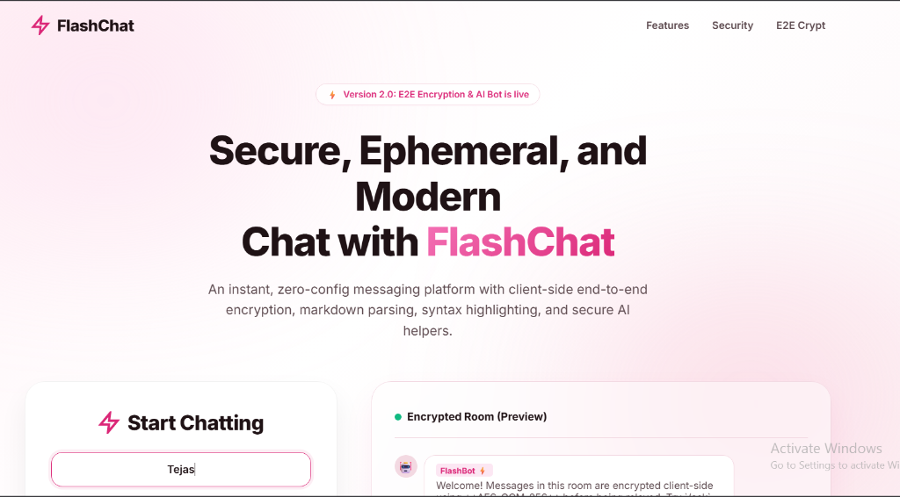
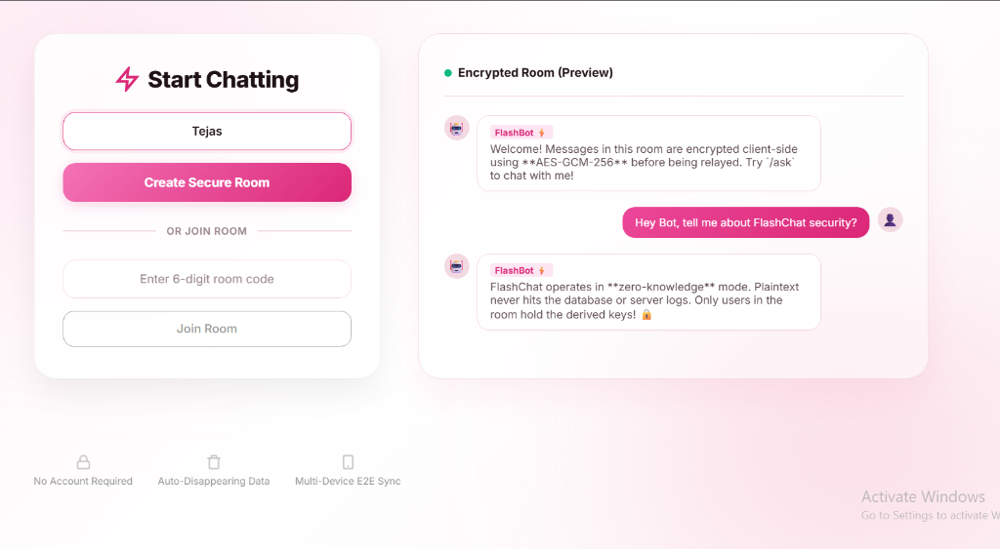
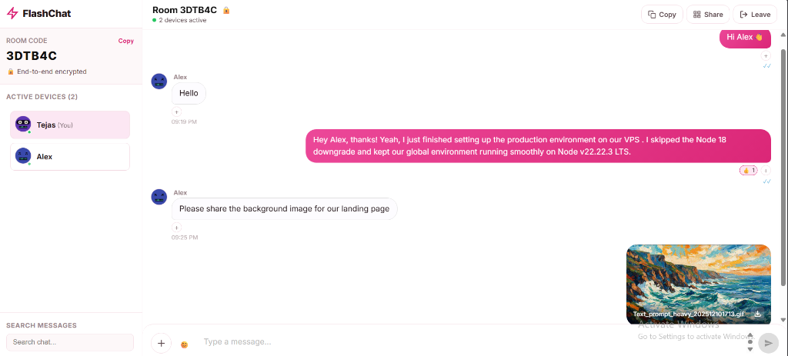
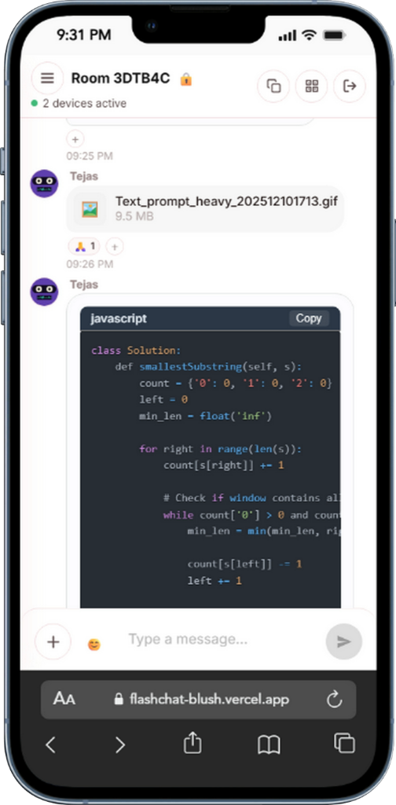
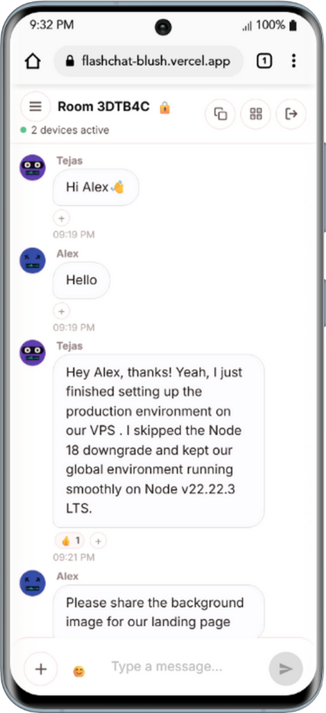
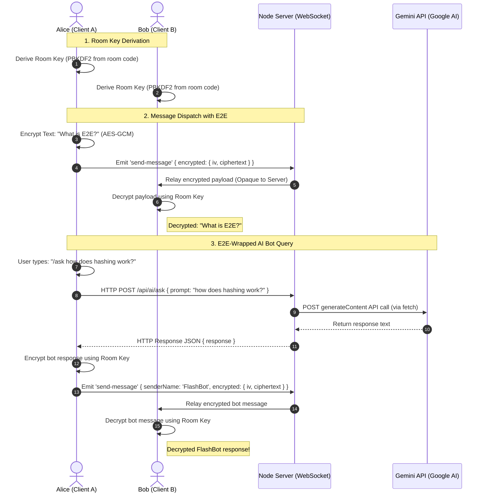

# ⚡ FlashChat — Ephemeral & E2E Encrypted Chat Portal

FlashChat is a privacy-first, zero-login, temporary messaging and file-sharing portal. It is designed to be a secure, zero-config workspace for developers and teams who need to share code snippets, files, and links in absolute privacy. Under the hood, it features client-side End-to-End Encryption (E2E) via Web Crypto APIs, alphanumeric room allocations, real-time message reactions, link previews, and a secure local AI assistant.

---

## 📸 Interface Showcase

### Elegant Landing & Setup



### Desktop Chat Interface


### Highly Responsive Mobile Layouts
<div align="center">
  
  &nbsp;&nbsp;&nbsp;&nbsp;
  
</div>

---

## 💻 My Experience with GitHub Copilot

FlashChat began as a raw, single-file JavaScript prototype—an abandoned monolithic `App.jsx` file (over 800 lines of spaghetti code) containing mixed logic for sockets, file chunking, UI components, and state management. The code was prone to runtime errors, vulnerable to XSS attacks, and lacked any mobile responsiveness.

By pairing with **GitHub Copilot**, I turned this prototype into a production-grade, modular, and highly secure web application. Here is how Copilot helped guide the journey:

### 1. Decomposing the Monolith (JS to TypeScript)
Refactoring a monolithic codebase can be tedious and error-prone. I asked Copilot to help split the single React file into 17 strongly-typed TypeScript components. 
* Copilot analyzed the unified React state and automatically generated clean TypeScript interface prop definitions for key components like [MessageBubble](file:///d:/FlashChat/client/src/components/chat/MessageBubble.tsx), [Sidebar](file:///d:/FlashChat/client/src/components/sidebar/Sidebar.tsx), and [InputBar](file:///d:/FlashChat/client/src/components/chat/InputBar.tsx).
* It speeded up the migration by suggesting proper Type parameters for event handlers and DOM references (`React.DragEvent`, `HTMLTextAreaElement`), ensuring zero compile-time errors.

### 2. Implementing client-side E2E Encryption
I wanted messages to be encrypted client-side using the **Web Crypto API (AES-GCM-256)** so that the server only acts as a blind relay.
* Instead of digging through pages of MDN documentation, Copilot helped me draft [crypto.ts](file:///d:/FlashChat/client/src/lib/crypto.ts). It instantly generated helper functions to derive shared keys from the alphanumeric room code using **PBKDF2**, handle binary arrays, and export/import public keys.
* When I got stuck on how to handle initialization vectors (IVs) safely in transit, Copilot recommended prepending the `iv` directly to the encrypted ciphertext and parsing it back during decryption—a standard, robust cryptographic pattern.

### 3. Creating a Mobile-First Responsive Layout
On mobile viewports, the chat layout was originally broken, with sent bubbles clipping off-screen and the sidebar stacking vertically.
* I used Copilot to refactor the [Sidebar](file:///d:/FlashChat/client/src/components/sidebar/Sidebar.tsx) into a sliding drawer. Copilot suggested CSS transitions and absolute positioning triggers that translate the sidebar off-screen (`transform: translateX(-100%)`) and sliding it in smoothly when the hamburger button is clicked.
* When the main chat container stretched and pushed the right-side components (like the send button and scroll indicators) off the screen on smaller viewports, Copilot pinpointed a classic flexbox issue and suggested adding `min-width: 0;` and `overflow: hidden;` to the `.chat-main` wrapper—instantly resolving the layout overflow.

### 4. Hardening Security (XSS & SSRF)
Security is paramount for an encrypted portal.
* Copilot helped write server-side middleware to sanitize text input using DOMPurify, and suggested SSRF protection blocks inside Nginx and the backend link scraper to verify that outgoing requests do not target private IP subnets.

---

## 🛡️ Core Features

- **🔐 End-to-End Encryption**: Key materials are derived client-side directly from the room code using **Web Crypto API (PBKDF2 / AES-256-GCM)**. The server acts as a blind relay and never processes plaintext.
- **⚡ Zero Setup Rooms**: Instant temporary rooms expire after 30 minutes of complete inactivity.
- **🤖 Secure AI Assistant**: Group-aware AI responder triggered via `/ask <prompt>` commands. Relies on server-side Gemini/OpenAI proxies to keep API keys secure while encrypting outputs back into the room.
- **📁 Chunked File Streaming**: Drag & drop any image, document, or archive. Files are streamed in 64KB chunks to ensure smooth multi-device syncing.
- **💬 Social Interactions**: Rich GitHub Flavored Markdown rendering, syntax-highlighted code snippets, iMessage-style hover reactions, quote replies, and live typing notifications.
- **🔗 Secure Link Previews**: Scrapes Open Graph headers server-side using cheerio with native SSRF protection blocking private IP access.

---

## 📐 System Architecture



---

## 🛠️ Local Development Quickstart

### Prerequisites
- Node.js 18+ (uses native fetch)
- npm

### 1. Repository Setup
Clone the repository and install the server-side backend dependencies:
```bash
git clone https://github.com/TejasRawool186/flashchat.git
cd flashchat
npm install
```

### 2. Client Setup
Install the client-side React and TypeScript dependencies:
```bash
cd client
npm install
```

### 3. Environment Variables
Create a `.env` file in the **server root** (see `package.json` location) to configure allowed origins and AI engines:
```env
PORT=3001
CORS_ORIGIN=http://localhost:5173
GEMINI_API_KEY=your_gemini_api_key_here
```

Create a `.env` file in the **client directory** (`client/.env`) to map the client URL:
```env
VITE_SERVER_URL=http://localhost:3001
```

### 4. Running the App
In the root directory, start both the Express backend and the Vite client simultaneously using the development loop:
```bash
npm run dev
```
Open [http://localhost:5173](http://localhost:5173) in your browser.

---

## ⚙️ Configuration Variables

| Variable | Scope | Description | Default |
|----------|-------|-------------|---------|
| `PORT` | Server | Port for the backend Express app | `3001` |
| `CORS_ORIGIN` | Server | Allowed CORS URLs (comma-separated list) | `http://localhost:5173` |
| `GEMINI_API_KEY` | Server | Google Gemini developer key for chatbot responses | *Optional (enables live AI)* |
| `OPENAI_API_KEY` | Server | OpenAI developer key (fallback to Gemini key) | *Optional* |
| `VITE_SERVER_URL`| Client | HTTP/WS URL pointing to the active API backend | `http://localhost:3001` |

---

## 🛡️ Verification Commands

Run these inside the `/client` directory to verify build state and type compatibility:
- **Lint Check**: `npm run lint`
- **TypeScript Strict Compile**: `npx tsc --noEmit`
- **Production Build Packaging**: `npm run build`

---

*FlashChat is released under the [MIT License](LICENSE).*
