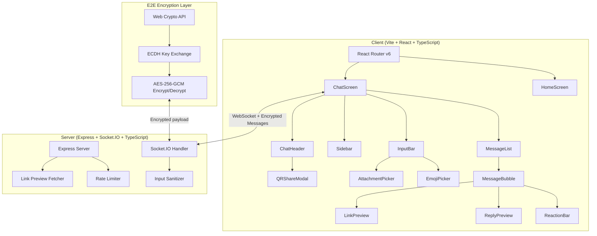

# FlashChat 3-Day Transformation — Implementation Plan

> **Sprint**: 3 days | **Start**: June 3, 2026 | **Goal**: Win GitHub Finish-Up-A-Thon

---

## User Review Required

> [!IMPORTANT]
> This plan covers **18 major deliverables in 3 days**. This is aggressive but achievable with parallel subagent execution. Review the daily breakdown and feature scoping below to confirm priorities.

> [!WARNING]
> **Link Previews (server-side OG fetching)** require a server-side HTTP client (e.g., `cheerio` + `node-fetch`) to scrape metadata. This adds backend complexity and potential security risks (SSRF). If time is tight on Day 2, this may be deferred.

---

## Architecture Overview

### Target Component Structure

```
client/src/
├── components/
│   ├── SplashScreen.tsx
│   ├── chat/
│   │   ├── ChatHeader.tsx
│   │   ├── ChatScreen.tsx
│   │   ├── InputBar.tsx
│   │   ├── MessageBubble.tsx
│   │   ├── MessageList.tsx
│   │   ├── CodeMessage.tsx
│   │   ├── ImageMessage.tsx
│   │   ├── FileMessage.tsx
│   │   ├── ReactionBar.tsx
│   │   ├── ReplyPreview.tsx
│   │   ├── TypingIndicator.tsx
│   │   ├── ScrollButton.tsx
│   │   ├── FileProgressTray.tsx
│   │   └── LinkPreview.tsx
│   ├── home/
│   │   ├── HomeScreen.tsx
│   │   └── FeatureBadges.tsx
│   ├── sidebar/
│   │   ├── Sidebar.tsx
│   │   ├── UserList.tsx
│   │   ├── RoomInfo.tsx
│   │   └── MessageSearch.tsx
│   ├── modals/
│   │   ├── AttachmentPicker.tsx
│   │   ├── ImageViewer.tsx
│   │   ├── QRShareModal.tsx
│   │   └── EmojiPickerModal.tsx
│   └── shared/
│       ├── Avatar.tsx
│       ├── Notification.tsx
│       └── DropZone.tsx
├── hooks/
│   ├── useSocket.ts
│   ├── useEncryption.ts
│   ├── useTypingIndicator.ts
│   └── useScrollManager.ts
├── lib/
│   ├── crypto.ts          (E2E encryption utilities)
│   ├── socket.ts          (socket.io config)
│   ├── linkPreview.ts     (client-side link handling)
│   └── utils.ts           (formatTime, formatFileSize, etc.)
├── types/
│   └── index.ts           (Message, Room, User interfaces)
├── App.tsx
├── main.tsx
├── index.css
└── App.css                (will be split into component CSS modules)

server/
├── server.ts
├── middleware/
│   ├── rateLimiter.ts
│   └── sanitizer.ts
├── handlers/
│   ├── roomHandlers.ts
│   ├── messageHandlers.ts
│   ├── fileHandlers.ts
│   └── linkPreviewHandler.ts
└── types/
    └── index.ts
```

### Architecture Diagram



---

## Proposed Changes

### Day 1: Foundation & Architecture (8-10 hours)

---

#### 1.1 TypeScript Migration + Component Decomposition

**This is the largest single task.** We break [App.jsx](file:///d:/FlashChat/client/src/App.jsx) (825 lines) into 25+ typed components.

##### [NEW] client/src/types/index.ts
- `Message` interface (id, text, senderId, senderName, timestamp, type, reactions, replyTo, etc.)
- `Room` interface (roomCode, users, createdAt, expiresAt, etc.)
- `User` interface (id, name, avatar, status)
- `FileTransfer` interface
- Socket event type definitions
- Encryption key types

##### [MODIFY] [App.jsx](file:///d:/FlashChat/client/src/App.jsx) → App.tsx
- Gut the 825-line monolith
- Becomes a thin shell: Router setup, global providers, layout
- ~50 lines max

##### [NEW] All component files (see architecture above)
- Extract SplashScreen, ChatScreen, HomeScreen, MessageBubble, InputBar, Sidebar, etc.
- Each component gets proper TypeScript props interfaces
- Each component gets its own CSS module or styled section

##### [MODIFY] [socket.js](file:///d:/FlashChat/client/src/socket.js) → lib/socket.ts
- TypeScript with proper event typing
- Environment variable for server URL: `import.meta.env.VITE_SERVER_URL`

##### [MODIFY] [main.jsx](file:///d:/FlashChat/client/src/main.jsx) → main.tsx
- Add `BrowserRouter` from react-router-dom
- Keep ErrorBoundary

##### [MODIFY] [vite.config.js](file:///d:/FlashChat/client/vite.config.js) → vite.config.ts
- Add environment variable handling

---

#### 1.2 React Router v6

##### [MODIFY] App.tsx
- Add routes: `/` (home), `/chat/:roomCode` (chat)
- `useNavigate()` replaces `setScreen()`
- Room code in URL enables shareable links

---

#### 1.3 E2E Encryption (Web Crypto API)

##### [NEW] client/src/lib/crypto.ts
Core encryption module:
```
- generateKeyPair(): Promise<CryptoKeyPair>     — ECDH P-256 key pair
- deriveSharedKey(privateKey, publicKey): Promise<CryptoKey>  — AES-256-GCM
- encrypt(key, plaintext): Promise<{iv, ciphertext}>
- decrypt(key, iv, ciphertext): Promise<string>
- exportPublicKey(key): Promise<string>          — Base64 for transmission
- importPublicKey(base64): Promise<CryptoKey>    — Reconstruct from base64
```

##### [NEW] client/src/hooks/useEncryption.ts
React hook that:
1. Generates key pair when joining a room
2. Exchanges public keys with all room members via socket
3. Derives shared keys for each peer
4. Provides `encrypt()` and `decrypt()` functions to components
5. Uses a room-level shared key (all participants derive the same key)

##### [MODIFY] server.ts
- Server relays encrypted payloads WITHOUT decrypting
- Add `key-exchange` socket event for public key distribution
- Messages are opaque `{iv, ciphertext}` blobs to the server

##### UI Indicators
- 🔒 Lock icon in ChatHeader showing "End-to-end encrypted"
- Encryption badge in Sidebar RoomInfo panel
- Subtle green shield animation when encryption handshake completes

---

#### 1.4 Security Hardening

##### [NEW] server/middleware/rateLimiter.ts
- `express-rate-limit` for HTTP endpoints
- Custom Socket.IO rate limiter: max 30 messages/minute per socket
- File upload limit: max 5 files/minute per socket

##### [NEW] server/middleware/sanitizer.ts
- Use `DOMPurify` (via `isomorphic-dompurify`) for all text inputs
- Validate message structure on server before broadcast
- Strip potential script injection from filenames

##### [MODIFY] [App.jsx](file:///d:/FlashChat/client/src/App.jsx)
- Replace `dangerouslySetInnerHTML` at line 145 with a safe highlighting approach
- Use a library like `highlight.js` with React bindings or pre-sanitized output

##### [MODIFY] [server.js](file:///d:/FlashChat/server.js)
- Add proper CORS configuration with environment variable for allowed origins
- Add Content Security Policy headers
- Validate file sizes on server side
- Validate room code format on server side

---

#### 1.5 Performance Fixes

##### [DELETE] client/public/world-map.svg (2.8 MB)
- Replace with a CSS-only subtle pattern background or a tiny compressed version (<30 KB)

##### [MODIFY] [App.css](file:///d:/FlashChat/client/src/App.css)
- Fix the stray `s` on line 99
- Split into component-level CSS files or CSS modules

---

### Day 2: Features (8-10 hours)

---

#### 2.1 QR Code Room Sharing

##### [NEW] client/src/components/modals/QRShareModal.tsx
- Uses `qrcode.react` library to generate QR code from room URL
- Room URL format: `https://flashchat.vercel.app/chat/{roomCode}`
- Buttons: Copy URL, Copy Room Code, Share (Web Share API), Close
- QR code styled with FlashChat branding (logo in center)

##### Install: `qrcode.react`

---

#### 2.2 Emoji Picker

##### [NEW] client/src/components/modals/EmojiPickerModal.tsx
- Uses `emoji-picker-react` library
- Triggered from InputBar emoji button
- Positioned above the input bar
- Selected emoji inserted at cursor position in message input

##### Install: `emoji-picker-react`

---

#### 2.3 Message Reactions

##### [NEW] client/src/components/chat/ReactionBar.tsx
- Quick reaction bar appears on message hover (desktop) or long-press (mobile)
- 6 quick emojis: 👍 ❤️ 😂 😮 😢 🙏
- "+" button opens full emoji picker for custom reaction
- Reactions displayed below message bubble with count
- Clicking an existing reaction toggles your reaction

##### Socket events:
- `add-reaction` → `{messageId, emoji, userId}`
- `remove-reaction` → `{messageId, emoji, userId}`
- Server broadcasts reaction updates to room

##### [MODIFY] types/index.ts
- Add `reactions: Map<string, string[]>` to Message interface (emoji → userId[])

---

#### 2.4 Quote-Reply

##### [NEW] client/src/components/chat/ReplyPreview.tsx
- Compact preview of the quoted message (sender name + truncated text)
- Displayed above the message bubble
- Clicking the reply preview scrolls to the original message

##### [MODIFY] InputBar.tsx
- Reply state: when user clicks "Reply" on a message, show reply preview above input
- Cancel reply button (✕)
- Include `replyTo: {id, text, senderName}` in sent message data

##### [MODIFY] types/index.ts
- Add `replyTo?: {id: string, text: string, senderName: string}` to Message

---

#### 2.5 Read Receipts

##### Socket events:
- `message-delivered` → Server confirms message received
- `message-read` → Client sends when message scrolls into viewport
- Server tracks: sent → delivered → read

##### UI:
- Single check ✓ = Sent
- Double check ✓✓ = Delivered
- Blue double check ✓✓ = Read

##### [MODIFY] MessageBubble.tsx
- Replace hardcoded `✔✔` with dynamic status indicator

---

#### 2.6 DiceBear Avatars

##### [NEW] client/src/components/shared/Avatar.tsx
- Uses DiceBear API URL: `https://api.dicebear.com/7.x/bottts/svg?seed={username}`
- Alternatively, generate locally with `@dicebear/core` + `@dicebear/collection`
- Fallback to letter avatar if DiceBear unavailable
- Displayed in: message bubbles, sidebar user list, chat header

##### Install: `@dicebear/core`, `@dicebear/collection` (or use API URL — zero deps)

---

#### 2.7 Functional Sidebar

##### [MODIFY → REWRITE] Sidebar.tsx
Three sections:

**Room Info Panel:**
- Room code with copy button
- 🔒 Encryption status badge
- User count
- Room creation time

**User List:**
- List of all users in the room
- DiceBear avatar + username
- Online status indicator (green dot)
- "You" label for current user

**Message Search:**
- Search input filters messages in real-time
- Matching messages highlighted in yellow in the chat
- Results count shown
- Click result to scroll to message

##### Socket events needed:
- Server broadcasts user list updates with usernames (currently only tracks socket IDs)
- `user-list-update` → `{users: [{id, name, joinedAt}]}`

---

#### 2.8 Markdown Rendering

##### [MODIFY] MessageBubble.tsx
- Use `react-markdown` with `remark-gfm` for GitHub-flavored markdown
- Use `rehype-sanitize` to prevent XSS
- Supports: **bold**, *italic*, ~~strikethrough~~, `inline code`, ```code blocks```, lists, tables, headers
- Code blocks use `react-syntax-highlighter` for proper highlighting (replaces custom `highlightCode` function)

##### Install: `react-markdown`, `remark-gfm`, `rehype-sanitize`, `react-syntax-highlighter`

---

#### 2.9 Link Previews

##### [NEW] server/handlers/linkPreviewHandler.ts
- HTTP endpoint: `GET /api/link-preview?url={encodedUrl}`
- Uses `cheerio` + `node-fetch` to scrape OG tags
- Returns: `{title, description, image, siteName, url}`
- SSRF protection: block private IPs, timeout after 5s
- Cache results in memory (Map) for 1 hour

##### [NEW] client/src/components/chat/LinkPreview.tsx
- Renders OG card below the message text
- Shows: thumbnail image, title, description, site name
- Clicking opens URL in new tab
- Loading skeleton while fetching

##### Install (server): `cheerio`

---

### Day 3: Polish & Ship (8-10 hours)

---

#### 3.1 UI Polish & Animations

##### [MODIFY] All CSS files
- Add smooth transitions to all interactive elements
- Add entrance animations to messages (already exists but refine)
- Add hover states to all buttons
- Add loading skeletons for async states
- Refine spacing, typography, and visual hierarchy
- Ensure dark-on-light monochrome palette is consistent
- Add subtle shadows and depth

---

#### 3.2 Deployment

##### [MODIFY] client/vite.config.ts
- Configure build for production
- Add environment variable for API URL

##### [NEW] .env.example
```
VITE_SERVER_URL=http://localhost:3001
PORT=3001
CORS_ORIGIN=http://localhost:5173
```

##### Vercel (Frontend)
- Connect GitHub repo to Vercel
- Set `client/` as root directory
- Set `VITE_SERVER_URL` env var pointing to Hostinger backend

##### Hostinger VPS (Backend)
- Install Node.js on VPS
- Use PM2 for process management
- Configure nginx reverse proxy for WebSocket support
- Set CORS_ORIGIN to Vercel URL
- SSL via Let's Encrypt

---

#### 3.3 GitHub Actions CI/CD

##### [NEW] .github/workflows/ci.yml
```yaml
name: CI
on: [push, pull_request]
jobs:
  check:
    runs-on: ubuntu-latest
    steps:
      - uses: actions/checkout@v4
      - uses: actions/setup-node@v4
      - run: cd client && npm ci && npm run lint && npx tsc --noEmit && npm run build
```

---

#### 3.4 Premium README

##### [MODIFY → REWRITE] README.md (root)
- Hero banner image (generated)
- Live demo link
- Feature grid with emoji icons
- Before/After comparison table
- Architecture diagram (Mermaid)
- Tech stack badges (shields.io)
- Screenshots/GIFs
- Setup instructions (dev + production)
- "Built with GitHub Copilot" section
- Environment variables table
- Contributing guide
- MIT License

##### [DELETE] client/README.md (Vite boilerplate)

---

#### 3.5 Stretch: AI Chat Assistant

If time permits on Day 3:

##### [NEW] client/src/components/chat/AIAssistant.tsx
- `/ask <question>` command in InputBar
- Sends to server → server calls AI API (Groq/OpenRouter)
- Streams response back as a bot message
- Bot has special avatar and styling

---

## Verification Plan

### Automated
- `npm run lint` — zero ESLint errors
- `npx tsc --noEmit` — zero TypeScript errors
- `npm run build` — successful production build
- GitHub Actions CI passes on push

### Manual Testing Checklist
- [ ] Create room → 6-digit code generated
- [ ] Join room → second device connects
- [ ] Send text message → appears on both devices
- [ ] Send code snippet → syntax highlighted, copyable
- [ ] Send file → chunked transfer, downloadable
- [ ] Drag & drop file → upload works
- [ ] E2E encryption → messages encrypted (verify in Network tab)
- [ ] QR code → scan QR, join room
- [ ] Emoji picker → insert emoji in message
- [ ] React to message → reaction appears
- [ ] Reply to message → quote-reply shown
- [ ] Read receipts → ✓ → ✓✓ → blue ✓✓
- [ ] Search messages → sidebar search filters results
- [ ] Link preview → paste URL, OG card appears
- [ ] Markdown → bold, italic, code blocks render
- [ ] Avatars → unique per username
- [ ] Mobile responsive → test at 375px width
- [ ] Leave room → proper cleanup
- [ ] Deploy → live URL works
